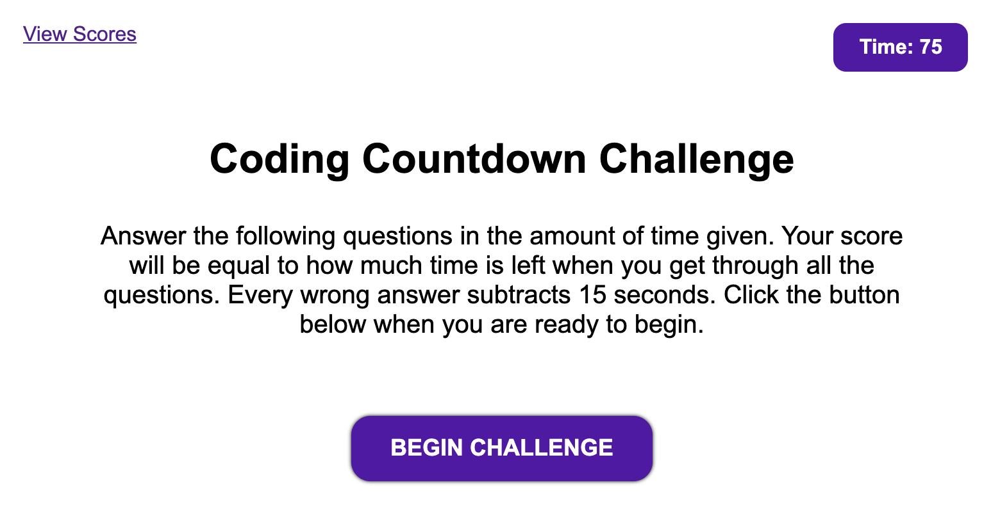

## Take a quiz to test your knowlege of some coding basics

### How well can you do? 
* Five questions
* Timer starts at 75 seconds
* 15 second penalty for wrong answers
* Your score is equal to the amount of time remaining when you've answered all the questions

Complete the challenge here:
[Coding Countdown Challenge](https://kohringsw.github.io/coding-countdown/)